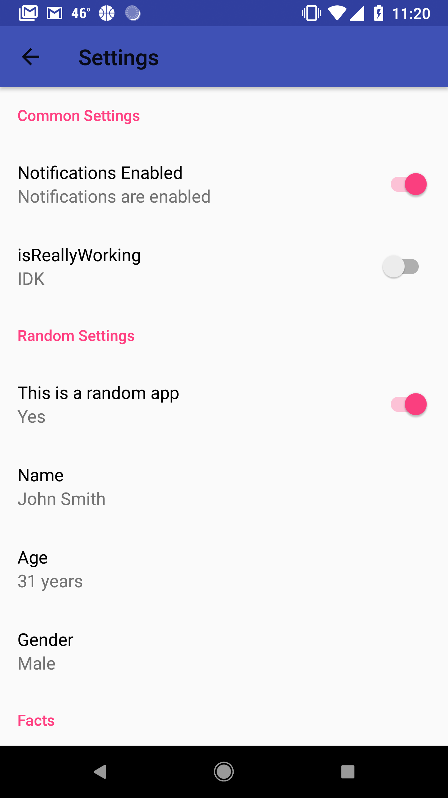

# Utilities

## Kotlin Utilities and Extensions for Android
##### Making Android Development Stupid Simple

## Download

Add utilites to your Android project using Jitpack and Gradle:

    repositories {
      maven {url 'https://jitpack.io'}
    }
    ...
    dependencies {
      implementation 'com.github.Sub6Resources:Utilities:1.3.0'
    }

## `BaseActivity`

`BaseActivity` is a super simple override of `AppCompatActivity` that removes unnecessary overrides to get straight to the point.

#### Simplest Example

    import com.sub6resources.utilities.BaseActivity
    
    class ExampleActivity: BaseActivity(R.layout.activity_example)
    
The above code is a super simple activity that does everything you would expect an Activity with no code to do: sit there.

When using fragments, the `BaseActivity` class becomes simple but powerful:

    import com.sub6resources.utilities.BaseActivity
    
    class MainActivity: BaseActivity(R.layout.activity_main) {
        override val landingFragment = LoginFragment() //LoginFragment extends BaseFragment
        override val fragmentTargets = R.id.fragment_target //Typically a FrameLayout
    }
    
The above code will handle FragmentTransactions for you! There are several methods you can use to add or remove fragments from the stack:

#### `addFragment(fragment: BaseFragment)`

Adds a fragment to the stack and displays it.

#### `popFragment()`

Pops the topmost fragment from the stack.

#### `switchFragment(fragment: BaseFragment)`

Pops all fragments from the stack and adds a new fragment. (This makes it so that when the back button is pressed, this fragment will be the only fragment in the stack, making it impossible to navigate backwards. Helpful for login screens and forms.)

#### Navigation Drawer on `BaseActivity`

`BaseActivity` handles a Navigation Drawer (hamburger menu) on its own with a couple simple overrides:

    import com.sub6resources.utilities.BaseActivity
    
    class DrawerActivity: BaseActivity(R.layout.activity_drawer) {
        override val drawer by lazy {drawer_layout} //A DrawerLayout instance (accessed using Kotlin's Android Extensions  )
        override val sideNav by lazy {navigation_view} //The NavigationView   (these can also be accessed with findViewById)
        
        //It is also helpful to override the toolbar object to create the drawer button automatically
        override val toolbar = R.id.toolbar
    }
    
### Helpful functions on `BaseActivity`

#### `startActivityForResult()` on `BaseActivity`

`BaseActivity` allows for a simple way to call `startActivityForResult` without ugly overrides:

    pick_contact_button.onClick {
        val pickContactIntent = Intent(Intent.ACTION_PICK, Uri.parse("content://contacts"));
        startActivityForResult(pickContactIntent) { resultCode, data ->
            //Perform operations on the result code and the data here
        }
    }

## `SettingsActivity`

`SettingsActivity` provides a simple DSL to create an activity that interfaces with sharedPreferences automatically with a given key. 

#### A DSL for an Android Settings Activity

    import com.sub6resources.utilities.*
    
    class PreferencesActivity: SettingsActivity() {
        override val settings = settingsActivity {
            title = "Settings"
            group("Common Settings") {
                setting("areNotificationsEnabled", false) {
                    description = "Notifications Enabled"
                    subtitleIfTrue = "Notifications are enabled"
                    subtitleIfFalse = "Notifications not enabled"
                }
                setting("isReallyWorking", true) {
                    subtitle = "IDK"
                }
            }
            group("Random Settings") {
                setting("isRandom", true) {
                    description = "This is a random app"
                    subtitleIfTrue = "Yes"
                    subtitleIfFalse = "No"
                }
                setting("name", "John Smith") {
                    description = "Name"
                }
                setting("age", 31) {
                    description = "Age"
                    units = "years"
                }
                setting("gender", "Male") {
                    description = "Gender"
                    options = arrayOf("Male", "Female")
                }
            }
            group("Facts") {
                setting("address", "") {
                    description = "Address"
                }
                setting("answer", 42) {
                    description = "The answer to life, the universe, and everything"
                }
            }
        }
    }
    
Here's what that code creates (but don't forget to register activity in the manifest)

## `PermissionActivity`

`PermissionActivity` provides a simple way to request Android runtime permissions for API 23 and above. The `checkPermission` and `checkListOfPermission` are also available from `BaseActivity`

### `PermissionActivity` from Kotlin

Example usage:
    
    import android.Manifest
    import com.sub6resources.utilities.PermissionActivity
    
    class MyActivity: PermissionActivity {
        ...
        checkPermission(Manifest.permission.RECORD_AUDIO,
            onGranted = {
                //Do something on permission granted.
            },
            onDenied = {
                //Do something on permission denied.
            },
            showExplanation = { id ->
                //Do something when an explanation dialog needs to be shown.
                recheckPermission(id)
            }
            ...
    }

This is an expanded example of the PermissionActivity. It will show a dialog for all permissions and if a permission is denied, will continue to show the dialog until the permission is granted.

Condensed example that does the exact same as above code:

    import android.Manifest
    import com.sub6resources.utilites.PermissionActivity
    
    class MyActivity: PermissionActivity {
        ...
        checkPermission(Manifest.permission.RECORD_AUDIO)
        ...
    }

### `PermissionActivity` from Java (Requires Java 8 or higher)

Example usage:
    
    import android.Manifest;
    import com.sub6resources.utilites.PermissionActivity;
    
    class MyActivity extends PermissionActivity {
        ...
        checkListOfPermissions(new String[] {Manifest.permission.CAMERA, Manifest.permission.READ_SMS}, //etc. Just make sure to include the permission in your manifest as well.
                    (permission) -> {
                        //Do something on permission granted.
                        return null;
                    },
                    (permission) -> {
                        //Do something on permission denied.
                        return null;
                    },
                    (permission, id) -> {
                        //Do when a permission needs to be explained to the user, then...
                        recheckPermission(id);
                        return null;
                    });
         ...
     }
     
 Condensed version:
 
     checkListOfPermissions(new String[] {Manifest.permission.CAMERA, Manifest.permission.READ_SMS})
                
This is the most basic java example for the PermissionActivity. It will show a dialog for all permissions and if a permission is denied, will continue to show the dialog until the permission is granted.

## `BaseApplication`

`BaseApplication` makes it super simple to initialize [Koin](https://github.com/Ekito/koin) and [Retrofit](https://github.com/square/retrofit)

    import com.sub6resources.utilities.BaseApplication
    
    class Application: BaseApplication(appModule)
    
    //A Koin Module. See Koin documentation for usage.
    val appModule = applicationContext {
        val retrofit = Retrofit.Builder().logged("http://example.com:5432")
        
        //APIs (LoginApi is a Retrofit interface)
        provide { retrofit.create(LoginApi::class.java) }
        
        //Repositories
        provide { LoginRepository(get()) }
        
        //ViewModels
        viewModel { LoginViewModel(get()) }
    }

## `BaseFragment`

`BaseFragment` is built to allow for stupid simple interfacing with a standalone `ViewModel` or a shared `ViewModel`

    import com.sub6resources.utilities.*
    
    class LoginFragment: BaseFragment() {
        override val fragLayout = R.layout.fragment_login
        val loginViewModel by getViewModel<LoginViewModel>()
        
        override fun setUp() {
            //Initialize UI components
            btn_login.onClick {
                loginViewModel.login(et_username.getString(), et_password.getString())
            }
            loginViewModel.token.observe(this, Observer { data ->
                //Operate on ViewModel data
            })
        }
    }
    
`BaseFragment` can also use the `addFragment` `switchFragment` and `popFragment` functions that `BaseActivity` has.

The `BaseActivity` that the `BaseFragment` is attached to can be accessed anywhere in the fragment with the immutable `baseActivity` variable.

Also useful is the `getSharedViewModel` function. This allows multiple `BaseFragment`s to access the same `ViewModel` for more powerful MVVM development:

    val dataViewModel by getSharedViewModel<DataViewModel>()
    
